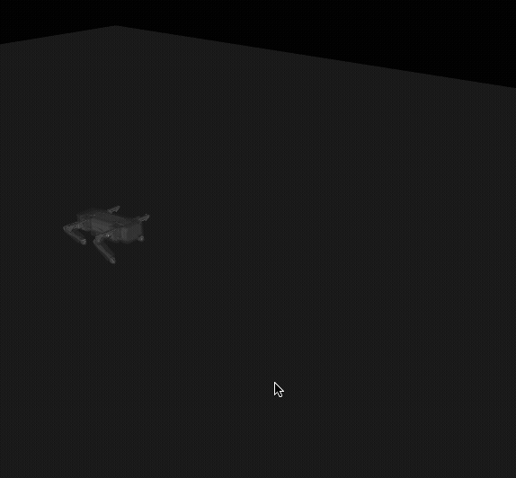
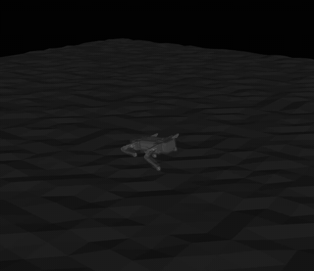
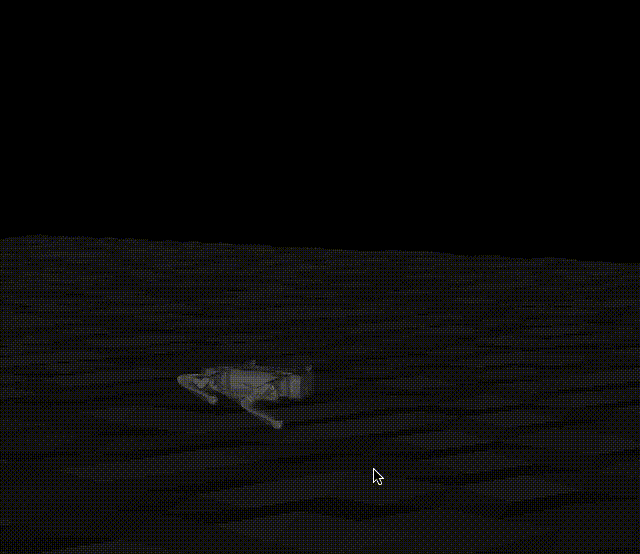

# Quadruped RL Environment (MuJoCo + Gymnasium)

### Overview
This repository contains a reinforcement learning environment and controller framework designed for training a quadruped robot to walk robustly over varied terrains using **MuJoCo** and **Gymnasium**.

The project is inspired by the dynamics and domain–randomized locomotion training pipeline from:  
**Dynamics and Domain Randomized Gait Modulation with Bezier Curves for Sim-to-Real Legged Locomotion** — https://arxiv.org/abs/2010.12070

While the original work used PyBullet environments, this project recreates the core concepts in **MuJoCo**, including:
- A Bezier-curve-based gait generator  
- Derived inverse kinematics  
- Terrain randomization  
- Dynamics randomization  
- A controller-modulating reinforcement learning policy  

---

# 🚀 Getting Started

### Environment Requirements
- Python **3.10** (recommended via `venv` or Conda)

### Install Dependencies
```bash
pip install -r requirements.txt
```

### Install Dependencies
```bash
mjpython <script_name>.py
```
## 📁 Script Descriptions

| File          | Description                                                                                     |
|---------------|-------------------------------------------------------------------------------------------------|
| `trot.py`     | Runs the baseline trot controller on completely flat terrain.                                   |
| `env_test.py` | Runs the baseline controller inside the randomized terrain environment, showing pre-policy behavior. |
| `train.py`    | Trains a PPO policy on the custom Gymnasium environment and outputs models to `/final_models`. |
| `inference.py`| Loads trained policies and demonstrates how they modulate the baseline controller.              |

## 🎥 Demo Videos

*(Placeholders — replace with your embedded videos or GIFs)*

### 1. Baseline Controller — Flat Terrain


### 2. Baseline Controller — Randomized Terrain (No Policy)


### 3. Trained Policy Modulating the Controller — Randomized Terrain


## 🧩 Project Motivation & Design

The referenced paper demonstrated that **massive domain and dynamics randomization** during training dramatically improves robustness and sim-to-real (sim2real) transfer.

This project aims to replicate those benefits in **MuJoCo**, using a hybrid approach where:

- A **hand-crafted controller** provides a stable trot gait structure.  
- An **RL policy** modulates controller parameters and adds small residuals to adapt the gait to varied terrain and dynamics.

The environment is built using the **Gymnasium** API, ensuring compatibility with standard RL libraries such as **Stable-Baselines3**.

---

## 🦿 Controller & Trajectory Generation

### Bezier Curve Foot Trajectory Generator

Each leg’s foot trajectory is generated using **two quadratic Bezier curves**:

- One curve for the **swing phase**  
- One curve for the **support phase**

These curves are parameterized by:

- **Clearance** — height of the swing foot  
- **Penetration** — vertical offset during stance  
- **L_span** — forward step length in the x-direction  

The resulting trajectory is converted into joint angles using **derived inverse kinematics** for the quadruped’s leg geometry.

---

### Trot Gait Coordination

- Legs are paired **diagonally** (front-left ↔ rear-right, front-right ↔ rear-left).  
- One pair is offset by **half a gait cycle** relative to the other.

This produces a classical **trot gait**, improving dynamic stability during locomotion.

---

### Quadruped Model

The robot model is based on this open-source quadruped design:

https://github.com/adham-elarabawy/open-quadruped

The original URDF was converted into a **MuJoCo-compatible XML** file for use in this environment.

---

### Role of the RL Policy

The RL policy does **not** output low-level torques or raw joint targets.  
Instead, it **wraps the existing controller** and outputs:

- Adjusted Bezier curve parameters (e.g., clearance, penetration, step length)  
- Small residual position offsets **(x, y, z)** added to each foot’s target trajectory  

This hybrid approach preserves the baseline stability of the hand-crafted controller while improving adaptability to:

- Rough or uneven terrain  
- Dynamics changes (e.g., mass or friction perturbations)  
- General robustness during locomotion  

## 🌍 Custom Gymnasium Environment

### Terrain

The environment consists of:

- A **base flat plane**
- A **height map** applied on top of the plane that introduces local variations in elevation

This height map generates:

- Bumps  
- Depressions  
- Irregular terrain patches  

The agent must learn to walk robustly across these uneven surface conditions.

---

## Observations Provided to the Policy

The observation vector contains information sufficient for the agent to:

- Maintain balance  
- Coordinate leg phases  
- React to terrain perturbations  

Current observations include:

### **IMU Data**
- Linear accelerations  
- Roll angle  
- Pitch angle  
- Yaw angle  

### **Gait Phase Data**
- The **normalized phase (0 → 1)** of each leg within its Bezier trajectory cycle  

These observations give the policy a sense of body orientation and gait timing without exposing unnecessary internal robot states.

---

## Domain & Dynamics Randomization

To promote robustness and domain invariance, the environment uses a callback during training that periodically randomizes key physical parameters.

Randomized elements include:

- Ground friction  
- Foot friction  
- Mass of the legs  
- Mass of the feet  
- Mass of the main body  
- Heightmap scaling along **x**, **y**, and **z** axes  

Randomization uses a multiplicative scale factor sampled from a Gaussian distribution:

- **Mean:** 1.0  
- **Standard deviation:** 0.2  

These perturbations introduce a wide range of terrain and dynamics variations throughout training.

---

## 🎯 Reward Structure

The reward function is designed to encourage **stable forward locomotion** while penalizing unstable body behavior.

### **Positive Reward**
- **Forward movement**  
  - Reward is proportional to forward velocity along the x-axis (forward progress).

### **Penalty Terms**

To promote stable walking, several penalties are applied:

- **High pitch or roll angles**  
  - Large deviations from level orientation are penalized.

- **High angular velocities** about roll, pitch, and yaw  
  - Discourages jittery or overly aggressive body rotations.

Overall, the reward structure encourages the robot to:

- Move forward efficiently  
- Maintain upright posture  
- Minimize unnecessary or unstable oscillations  

## ✔️ Training Results

The environment has been tested using **PPO** from the **Stable-Baselines3** library.

Observed behaviors include:

- **Smoother and more stable walking gaits** on varied terrain compared to the baseline controller alone.  
- **Improved robustness** to heightmap variations and dynamics randomization.  
- **Enhanced lateral and rotational behavior**, even though training focuses solely on forward motion—an effect consistent with findings from the referenced paper.

---

## 📝 Notes & Future Work

Potential future improvements and extensions include:

### **Additional Gaits**
- Pace  
- Bound  
- Gallop  

### **More Complex Terrain Types**
- Discrete steps  
- Rocks and obstacles  
- Sloped ramps  

### **Advanced Training Strategies**
- Curriculum learning (progressive difficulty)  
- Multi-task learning for different locomotion objectives  

### **Controller and IK Enhancements**
- Improved inverse kinematics solvers  
- Alternative trajectory generators  
- Integration with Model Predictive Control (MPC) or other advanced control schemes  
